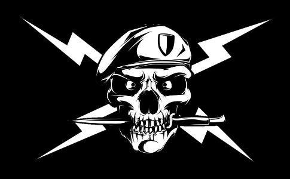

# Stratégie de Branching - projet QGL StormBreakers

## Table des matières

* [Master](#master)
* [Prod](#prod)
* [Develop](#develop)
* [Feature](#feature)
* [Hotfix](#hotfix)

### Master

Seule la prod et les correctifs sont autorisés à modifier cette branche. Interdiction de développer directement dessus.

### Prod

Convention de nommage de la branche prod : **prod**

* La branche prod peut être modifiée à n'importe quel moment, mais de préférence pas directement.
* Avant le merge vers master, attendre que les autres contributeurs acceptent la pull request.
  * :exclamation: Ne sera mergée à master que lorsque son contenu contiendra tout ce qui est requis pour la release correspondante, et qu'il soit documentée et complétement testé.
  * Le commit qui déclenchera le merge doit être taggé avec le bon nom de la nouvelle release.

### Develop

Convention de nommage de la branche prod : **develop**

* La branche develop peut être modifiée à n'importe quel moment, et est faite pour être instable.
* Le but de cette branche est la mise en commun de branches de type Feature lorsque cela est nécessaire (par exemple, si une feature a besoin qu'une autre soit réalisée pour être complète).

### Feature

Convention de nommage des branches features : **feature/...** "..." étant le nom du nouveau feature.

* Une ou plusieurs features peuvent soummettre une pull request à une branche prod.
* Avant le merge vers prod, attendre que les autres contributeurs acceptent la pull request.

### Hotfix

Convention de nommage des branches correctifs : **hotfix/...** "..." étant le nom du correctif à corriger.

* Un correctif peut soumettre une pull request vers n'importe quelle branche.
* Avant le merge vers la branche souhaitée, attendre que les autres contributeurs acceptent la pull request.